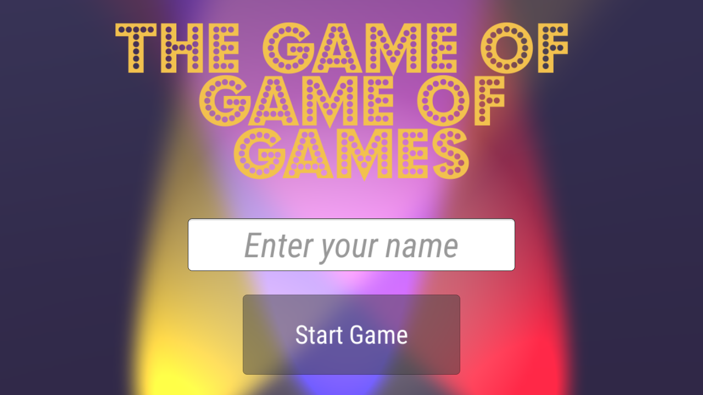

# The Game of Game of Games

A game created by [Mark Arneman](https://arneman.me) for the [#TVGameJam](https://itch.io/jam/tvgamejam).

**Play in your browser or download it [here](https://bearlikelion.itch.io/the-game-of-game-of-games)!**

**[View the highscores](https://arneman.me/thegameofgameofgames/) online!**

## About

The Game of Game of Games is my entry into the [#TVGameJam](https://itch.io/jam/tvgamejam). This was a **solo development effort as well as my first released game!** It was inspired by the television show, [Ellen's Game of Games](https://www.nbc.com/ellens-game-of-games).

The project source is available on [GitHub​](https://github.com/bearlikelion/thegameofgameofgames)

The player is prompted to select a category and answer the corresponding questions within a ten second time limit. If they get one answer wrong they fail the category and must choose another.  Three strikes and you're out! There is also a challenge mode that endlessly shuffles categories until the strike limit is reached.

The game treats each correct answer as a point and stores the time remaining for every correct answer as the player's speed. Scores are submitted to the [leaderboard](https://arneman.me/thegameofgameofgames/) sorted by questions correct and then by speed.

> Thanks to my wonderful wife Carina for helping with design, playtesting, and research

## Development

* [Unity 2017 LTS](https://unity3d.com/)
* Audio from [Freesound](https://freesound.org/)
* Animations using [DOTween](http://dotween.demigiant.com/)
* Highscores powered by [dreamlo](http://dreamlo.com)

### Data Classes

The questions are entered by [System.Serializable] classes within Unity's Inspector making them easy to change from within the editor.

### Secret.cs

The 'Secret' class is meant to keep the Dreamlo private keys out of the public git repository. There is a Secret.cs.example file to be renamed to Secret.cs and modified with your information.

### Web Leaderboard
* [Bootstrap 4](https://github.com/twbs/bootstrap)
* [lscache](https://github.com/pamelafox/lscache) to cache Dreamlo JSON Response
* [thenBy](https://github.com/Teun/thenBy.js) to sort scores

## License
[MIT](./LICENSE.md) License